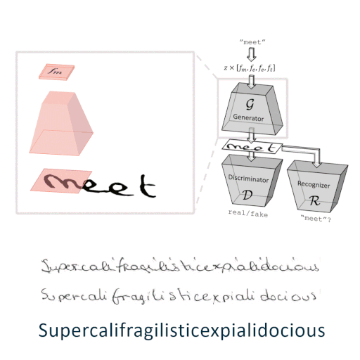

# ScrabbleGAN: Semi-Supervised Varying Length Handwritten Text Generation



This is a pytorch implementation of the paper 
["ScrabbleGAN: Semi-Supervised Varying Length Handwritten Text Generation"](https://www.amazon.science/publications/scrabblegan-semi-supervised-varying-length-handwritten-text-generation)

### Dependency
- This work was tested with PyTorch 1.2.0, CUDA 9.0, python 3.6 and Ubuntu 16.04. 
- requirements can be found in the file environmentPytorch12.yml. The command to create the environment from the file is:
```conda env create --name pytorch1.2 --file=environmentPytorch12.yml```
- To activate the environment use:
```source activate pytorch1.2```

### Training

* To view the results during the training process, you need to set up a visdom port:
```visdom -port 8192```

#### Supervised Training
 ```
 python train.py --name_prefix demo --dataname RIMEScharH32W16 --capitalize --display_port 8192 
 ```

* Main arguments:
    * `--name`: unless specified in the arguments, the experiment name is determined by the name_prefix, the dataset and parameters different from the default ones (see code in `options/base_options.py`).
    * `--name_prefix`: the prefix to the automatically generated experiment name.
    * `--dataname`: name of dataset which will determine the dataroot path according to data/dataset_catalog.py
    * `--lex`: the lexicon used to generate the fake images. There is a default lexicon for english/french data specified in `options/base_options.py`. 
    * `--capitalize`: randomly capitalize first letters of words in the lexicon used.
    * `--display_port`: visdom display port
    * `--checkpoints_dir`: the networks weights and sample images are saved to `checkpoints_dir/experiment_name`.
    * `--use_rnn`: whether to use LSTM
    * `--seed`: determine the seed for numpy and pytorch instead of using a random one.
    * `--gb_alpha`: the balance between the recognizer and discriminator loss. Higher alpha means larger weight for the recognizer.
* Other arguments are explained in the file `options/base_options.py` and `options/train_options.py`.


#### Semi-Supervised Training
```
python train_semi_supervised.py --dataname IAMcharH32W16rmPunct --unlabeled_dataname CVLtrH32 --disjoint
```
* Main arguments:
    * `--dataname`: name of dataset which will determine the labeled dataroot path according to data/dataset_catalog.py. This data is used to train only the Recognizer (in the disjoint case) or the Recognizer and the Discriminator networks.
    * `--unlabeled_dataname`: name of dataset which will determine the unlabeled dataroot path according to data/dataset_catalog.py. This data is used to train only the Discriminator network.
    * `--disjoint`: Disjoint training of the discriminator and the recognizer (each sees only the unlabeled/labeled data accordingly).

* Other arguments are explained in the file `options/base_options.py` and `options/train_options.py`.


### LMDB file generation for training data
Before generating an LMDB download the desired dataset into `Datasets`:
* IAM
    * Download the dataset from http://www.fki.inf.unibe.ch/databases/iam-handwriting-database
    * The partition into directories was downloaded from https://github.com/jpuigcerver/Laia/tree/master/egs/iam/data/part/lines/original.
* RIMES - download the dataset from http://www.a2ialab.com/doku.php?id=rimes_database:start
* CVL - download the dataset from https://cvl.tuwien.ac.at/research/cvl-databases/an-off-line-database-for-writer-retrieval-writer-identification-and-word-spotting/
The dictionaries used for training in the paper were not generated from the datasets, but rather downloaded and saved to the Datasets/lexicon.
* english_words.txt - https://github.com/dwyl/english-words/blob/master/words.txt
* Lexique383.tsv - https://github.com/AdrienVannson/Decorrecteur/blob/master/Lexique383

The structure of the directories should be:

* Datasets
    * IAM
        * wordImages        (the downloaded words dataset)
        * lineImages        (the downloaded lines dataset)
        * original          (the downloaded xml labels data)
        * original_partition        (the downloaded partition)
            * te.lst
            * tr.lst
            * va1.lst
            * va2.lst
    * RIMES
        * orig              (the downloaded dataset)
            * training_WR
            * groundtruth_training_icdar2011.txt
            * testdataset_ICDAR
            * ground_truth_test_icdar2011.txt
            * valdataset_ICDAR
            * ground_truth_validation_icdar2011.txt
    * CVL
        * cvl-database-1-1      (the downloaded dataset)
            * trainset
            * testset
            * readme.txt
    * Lexicon
        * english_words.txt
        * Lexique383.tsv

To generate an LMDB file of one of the datasets CVL/IAM/RIMES/GW for training use the code:
```
cd data
python create_text_data.py
```
* Main arguments (determined inside the file):
    * `create_Dict = False`: create a dictionary of the generated dataset
    * `dataset = 'IAM'`: CVL/IAM/RIMES/gw
    * `mode = 'va2'`: tr/te/va1/va2/all
    * `labeled = True`: save the labels of the images or not.
    * `top_dir = 'Datasets'`: The directory containing the folders with the different datasets.
    * `words = False`: parameter relevant for IAM/RIMES. Use words images, otherwise use lines
    * parameters relevant for IAM:
    * `offline = True`: use offline images
    * `author_number = -1`: use only images of a specific writer. If the value is -1, use all writers, otherwise use the index of this specific writer
    * `remove_punc = True`: remove images which include only one punctuation mark from the list ['.', '', ',', '"', "'", '(', ')', ':', ';', '!']
    * resize parameters:
    * `resize='noResize'`: charResize|keepRatio|noResize - type of resize, char - resize so that each character's width will be in a specific range (inside this range the width will be chosen randomly), keepRatio - resize to a specific image height while keeping the height-width aspect-ratio the same. noResize - do not resize the image
    * `imgH = 32`: height of the resized image
    * `init_gap = 0`: insert a gap before the beginning of the text with this number of pixels
    * `charmaxW = 18`: The maximum character width
    * `charminW = 10`: The minimum character width
    * `h_gap = 0`: Insert a gap below and above the text
    * `discard_wide = True`: Discard images which have a character width 3 times larger than the maximum allowed character size (instead of resizing them) - this helps discard outlier images
    * `discard_narr = True`: Discard images which have a character width 3 times smaller than the minimum allowed charcter size.

The generated lmdb will be saved in the relevant dataset folder and the dictionary with be saved in Lexicon folder.

### Generating an LMDB file with GAN data
```
python generate_wordsLMDB.py --dataname IAMcharH32rmPunct --results_dir ./lmdb_files/IAM_concat --n_synth 100,200 --name model_name 
```
 * Main arguments:
    * `--dataname`: name of dataset which will determine the dataroot path according to data/dataset_catalog.py. note that will be concatenated to the generated image.
    * `--no_concat_dataset`: ignore “dataname” (previous parameter), do not concatenate
    * `--results_dir`: path to result, will be concatenated with "n_synth"
    * `--n_synth`: number of examples to generate in thousands
    * `--name`: name of model used to generate the images
    * `--lex`: lexicon used to generate the images 

### Main Folders
The structure of the code is based on the structure of the [CycleGAN code](https://github.com/junyanz/CycleGAN).
1. data/ - Folder containing functions relating to the data, including generation, dataloading, alphabetes and a catalog which translates dataset names into folder location. The dataset_catalog should be updated according to the path to the lmdb you are using.
2. models/ - Folder containing the models (with the forward, backward and optimization functions) and the network architectures. The generator and discriminator architectures are based on [BigGAN](https://github.com/ajbrock/BigGAN-PyTorch). The recognizer architecture is based on [crnn](https://github.com/Holmeyoung/crnn-pytorch).
3. options/ - Files containing the arguments for the training and data generation process.
4. plots/ - Python notebook files with visualizations of the data.
5. util/ - General function that are used in packages such as loss definitions.


## Citation
If you use this code for your research, please cite our paper.
```bibtex
@inproceedings{fogel2020scrabblegan,
    title={ScrabbleGAN: Semi-Supervised Varying Length Handwritten Text Generation},
    author={Sharon Fogel and Hadar Averbuch-Elor and Sarel Cohen and Shai Mazor and Roee Litman},
    booktitle = {The IEEE Conference on Computer Vision and Pattern Recognition (CVPR)},
    month = {June},
    year = {2020}
}
```


## License
ScrabbleGAN is released under the MIT license. See the [LICENSE](LICENSE) and [THIRD-PARTY-NOTICES.txt](THIRD-PARTY-NOTICES.txt) files for more information.

## Contributing
Your contributions are welcome!  
See [CONTRIBUTING.md](CONTRIBUTING.md) and [CODE_OF_CONDUCT.md](CODE_OF_CONDUCT.md) for more info.